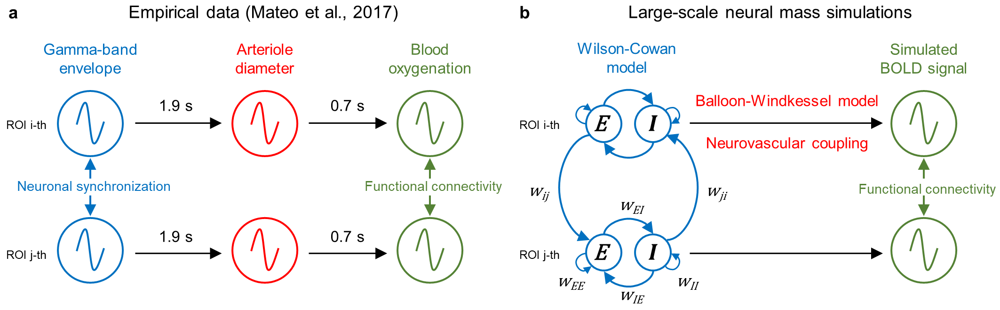

# Comparison of Task-Modulated Functional Connectivity (TMFC) Methods

Repository for code and simulations from    
**"Comparison of whole-brain task-modulated functional connectivity methods for fMRI task connectomics"**  
by Masharipov, R., Knyazeva, I., Korotkov, A., Cherednichenko, D. &amp; Kireev, M.

Use the repository [Discussions](https://github.com/Masharipov/TMFC_simulations/discussions) for questions or email masharipov@ihb.spb.ru

## Overview

Here, we provide:

1. [Task design files](task_designs) (.*mat format) containing stimulus onsets, durations, condition names, and weighting factors for synaptic matrices.  
   **Onsets**, **durations** and **condition names** are defined in the same way as for **multiple conditions** *.mat file for SPM12.
  
3. [Python code](python_code) for TMFC simulations based on **large-scale Wilson-Cowan neural mass model** and **Ballon-Windkessel haemodynamic model**.

4. User-friendly [Jupyter notebooks](jupyter_notebooks) for reproducing our simulations.

5. [Simulated BOLD time series files](simulated_BOLD_time_series) (*.mat format) for all experiments presented in the paper.

6. SPM12-based [MATLAB code](matlab_code) for TMFC analysis using:
    * correlation difference approach (**CorrDiff**),
    * standard psychophysiological interactions (**sPPI**),
    * generalised psychophysiological interactions (**gPPI**),
    * correlational psychophysiological interactions (**cPPI**),
    * beta-series correlations based on least-squares-all approach (**BSC-LSA**),
    * beta-series correlations based on least-squares-separate approach (**BSC-LSS**).

## TMFC Simulations

Our simulation approach was based on the coupled oscillator model for functional connectivity (see [Mateo et al., 2017](https://doi.org/10.1016/j.neuron.2017.10.012)), according to which functional connectivity measured by fMRI arises from a correlation between ultra-slow BOLD oscillations caused by ultra-slow modulation of the envelopes of synchronised gamma-band oscillations:

Gamma-band oscillations are linked to sensory processing, motor acts, and cognitive processes and are thought to underlie information processing and transmission. The spectral power (or envelope) of gamma-band oscillations fluctuates very slowly with time, and brain regions with shared function demonstrate co-fluctuation of gamma-band envelopes. Animal and human studies have shown that local field potential power in the gamma band is the closest electrophysiological correlate of spontaneous and evoked BOLD signals.\n",

Empirical study by [Mateo et al. (2017)](https://doi.org/10.1016/j.neuron.2017.10.012) used optogenetic manipulations and concurrently measured local field potential, arteriole diameter and blood oxygenation in awake mice. They provided direct evidence that an increase in gamma-band power leads to an increase in arteriole diameter, and an increase in arteriole diameter leads to an increase in blood oxygenation. In accordance with previous empirical observations, we observed strong correlations between simulated ultra-slow fluctuations of the gamma-band envelope and time-shifted BOLD signal:

The simulation procedure included five steps:
    1. Simulation of gamma-band oscillatory neuronal activity for 100 interconnected brain regions using Wilson-Cowan equations. Synaptic weights between 100 brain regions depend on the task conditions, which allow to control the ground-truth TMFC. Transient activity-dependent modulation of synaptic strength, lasting from tens of milliseconds to several minutes, is referred to as short-term synaptic plasticity.
    2. Simulation of simple co-activations using box-car functions. Co-activations are simultaneous activations (task-evoked hemodynamic responses) without communication between brain regions.
    3. Using the Balloon-Windkessel haemodynamic model to convert oscillatory neuronal activity and co-activations into BOLD signals.
    4. Downsampling of the BOLD signal to different time resolutions.
    5. Adding white Gaussian noise to model scanner measurement error. This step was done in MATLAB (see 'MATLAB_scripts' folder).

## TMFC Analysis

